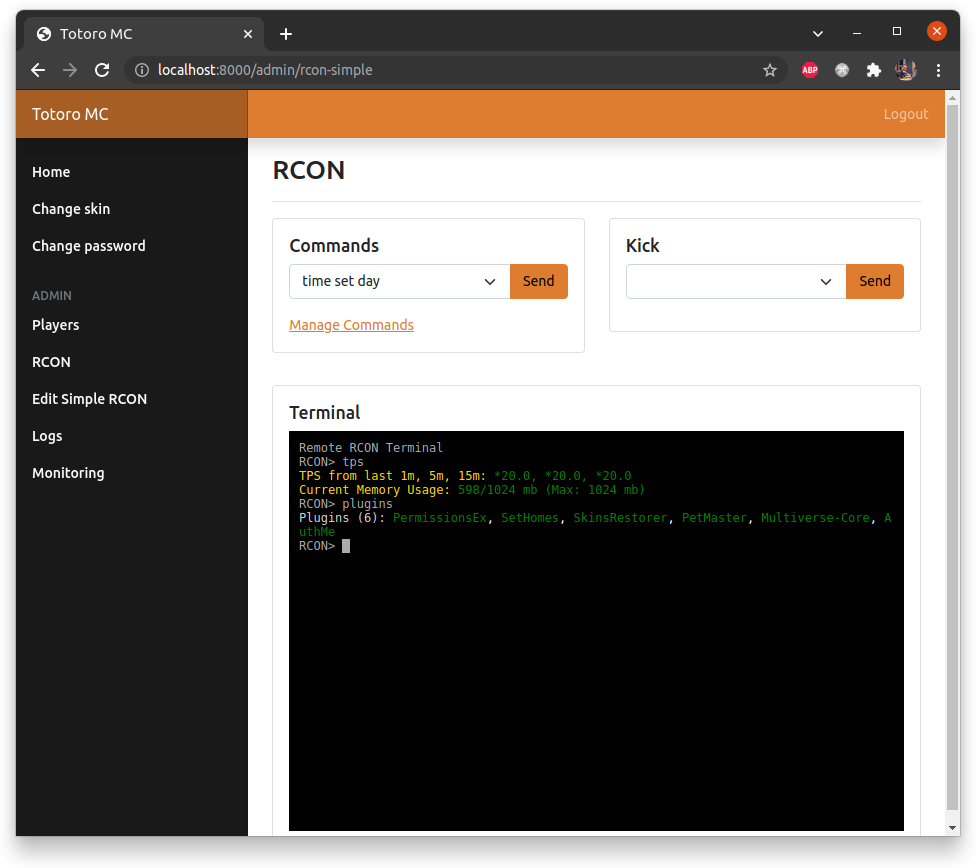

# Minecraft User and Admin Portal

Laravel 8 web panel for your Minecraft users and OPs.

## All Available Features 
- AuthMe authentication, password change
- Registration or invitation link only registration
- SkinRestorer skin changer
- Server status page
- Server status API endpoint for integrating to your homepage
- Permission system (guest/admin)
- Player administration
- Assign roles/permission to users
- Simple RCON with pre-defined commands and to kick players
- RCON terminal with Minecraft color/format code support
- Logging for Models and sent RCON commands
- Server Monitoring (TPS, RAM, Ping, Online Players)
- Multilingual (english and hungarian, easily translatable)

## Planned Features
- Web installer/updater

## How To Use

> Warning! This project relies on AuthMe MySQL tables (AuthMe default configuration) for authentication.
> You NEED AuthMe for this project to work, there are no migrations for these tables in this project.

- clone repository
- `composer install`
- `chmod +x storage`
- copy `.env.exampe` to `.env`
- edit `.env` (check below)
- `php artisan key:gen`
- `php artisan migrate`

If you want to use the monitoring features you need a new crontab entry:

`* * * * * cd /path-to-your-project && php artisan schedule:run >> /dev/null 2>&1`

At the beginning, every user is guest, and only have access to skin change and password change.

To give your user an admin role, execute this command: `php artisan mcp:add_admin yourusername`

## .env Settings

Required settings:

| Key | Description | Default |
| --- | ----------- | ------- |
| APP_NAME | Used in the HTML title, header, login page. Probably your Minecraft server name | Your Server Name |
| APP_DEBUG | **ALWAYS** false on production servers! | false |
| DB_HOST | MySQL server IP | 127.0.0.1 |
| DB_PORT | MySQL server port | 3306 |
| DB_DATABASE | MySQL database (where AuthMe and SkinRestorer tables are) | laravel |
| DB_USERNAME | MySQL username | root |
| DB_PASSWORD | MySQL password | |
| APP_LOCALE | Application language. Currently `en` and `hu` is supported. | en |
| MINECRAFT_SERVER | Your Minecraft server's IP address or hostname | 127.0.0.1 |
| MINECRAFT_QUERY_PORT | Your Minecraft server's port | 25565 |
| MINECRAFT_RCON_PORT | RCON port | 25575 |
| MINECRAFT_RCON_PASSWORD | RCON password | |
| MINECRAFT_RCON_TIMEOUT | RCON timeout | 10 |
| APP_OPEN_REGISTRATION | If true, people can register a new user without invitation | false |
| MONITORING_CLEAN_AFTER | Daily cleanup will remove this many days old monitoring data | 30 |

## Thanks for checking this out!

Feel free to create issues, pull-requests, etc.
