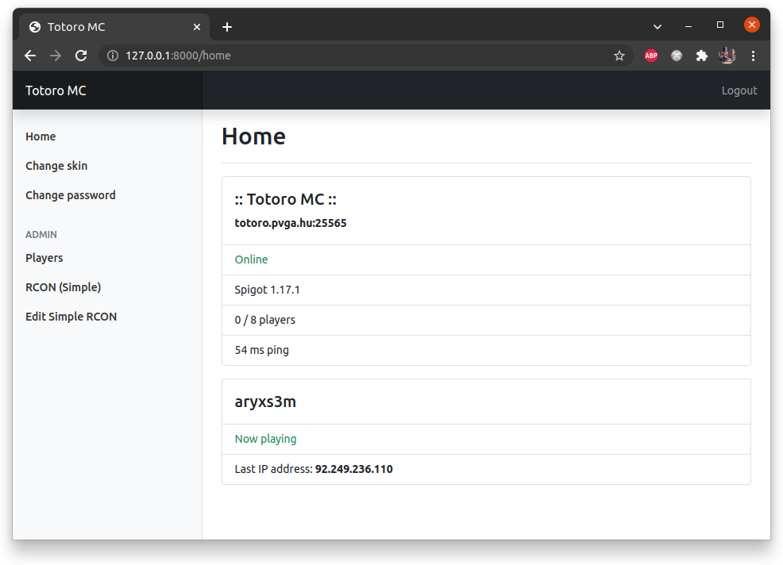

# Minecraft User and Admin Portal

Laravel 8 web application for your users and OPs.

## Current Features 
- AuthMe authentication, password change
- Registration or invitation link only registration
- SkinRestorer skin changer
- Server status page
- Server status API endpoint for integrating to your homepage
- Permission system (guest/admin)
- Player administration
- Assign roles/permission to users
- Simple RCON with pre-defined commands and to kick players
- Logging for Models and sent RCON commands
- Multilingual (english and hungarian, easily translatable)

## Planned Features
- Expert RCON terminal
- Web installer/updater

## How To Use
- clone repository
- `composer install`
- `chmod +x storage`
- copy `.env.exampe` to `.env`
- edit `.env` (check below)
- `php artisan key:gen`
- `php artisan migrate`

At the beginning, every user is guest, and only have access to skin change and password change.

To give your user an admin role, execute this command: `php artisan mcp:add_admin yourusername`

## .env Settings

Required settings:

| Key | Description |
| --- | ----------- |
| APP_NAME | Used in the HTML title, header, login page. Probably your Minecraft server name |
| APP_DEBUG | **ALWAYS** false on production servers! |
| DB_HOST | MySQL server IP |
| DB_PORT | MySQL server port |
| DB_DATABASE | MySQL database (where AuthMe and SkinRestorer tables are) |
| DB_USERNAME | MySQL username |
| DB_PASSWORD | MySQL password |
| CACHE_DRIVER | If you have Redis installed, set it to `redis`, otherwise `file` is okay |
| SESSION_DRIVER | If you have Redis installed, set it to `redis`, otherwise `file` is okay |
| APP_LOCALE | Application language. Currently `en` and `hu` is supported.
| MINECRAFT_SERVER | Your Minecraft server's IP address or hostname |

Extra settings:

| Key | Description |
| --- | ----------- |
| MINECRAFT_QUERY_PORT | Your Minecraft server's port |
| MINECRAFT_RCON_PORT | RCON port |
| MINECRAFT_RCON_PASSWORD | RCON password |
| MINECRAFT_RCON_TIMEOUT | RCON timeout |

## Thanks for checking this out!

Feel free to create issues, pull-requests, etc.
